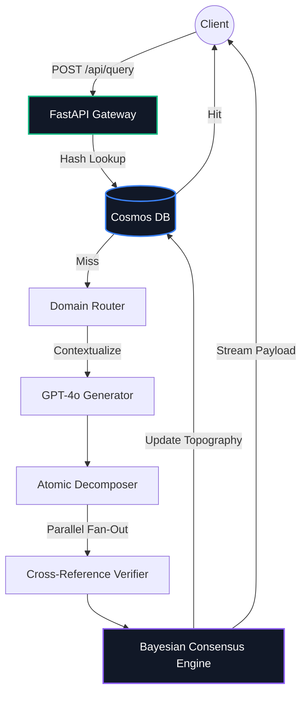
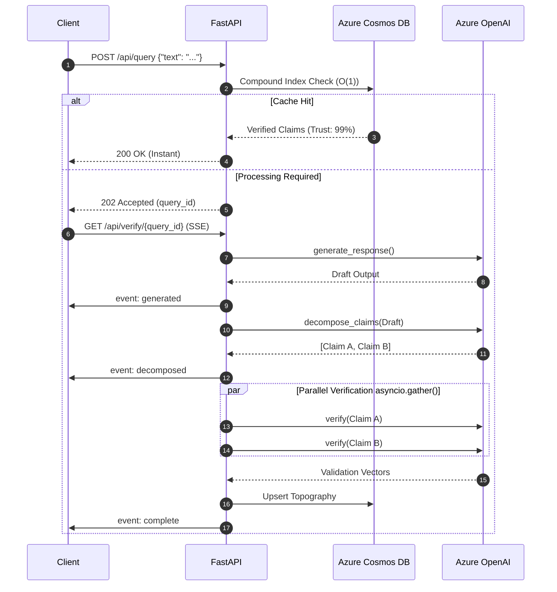

<div align="center">
  
  <h1>TruthMesh Verification Engine</h1>
  <p><strong>A Pre-Cognitive, Self-Auditing Hallucination Topography Engine for Enterprise AGI</strong></p>

  <p>
    
    
    
    
    
    
  </p>
</div>

---

## 🛑 The Core Problem: Why Most Enterprise AI Pilots Fail
The industry standard "Retrieval-Augmented Generation" (RAG) is fundamentally brittle. It retrieves context blindly and assumes the LLM will synthesize it perfectly. In production, this results in high-confidence hallucinations, destroying user trust and preventing operational deployment in high-stakes environments (Finance, Healthcare, Legal). 

TruthMesh is not a wrapper. It is a **deterministic constraint layer** that intercepts outputs, atomizes them, and mathematically forces convergence before a user ever sees a finalized claim.

---

## 🏗 System Architecture & Topography

TruthMesh solves latency via an event-driven Server-Sent Events (SSE) pipeline, backed by O(1) indexed caching in Cosmos DB. This means repeated queries bypass the LLM entirely, serving in `<50ms`.

### 1. The Request Lifecycle



### 2. The Verification Pipeline (SSE Streaming)

Unlike amateur projects that block the UI while awaiting an API response, TruthMesh opens a persistent SSE connection. As the backend decomposes claims and validates them in parallel, the frontend paints a dynamic topography map—giving the user complete transparency into the audit.



---

## ⚡ Technical Differentiators (The "So What?")

1.  **Zero Artificial Latency:** Where others "fake" processing to look impressive, TruthMesh is strictly optimized. The Python backend utilizes `asyncio.gather()` to fan out multiple verification requests to Azure OpenAI simultaneously. 
2.  **O(1) Data Retrieval:** Raw MongoDB is slow at scale. TruthMesh enforces compound indexing (`user_id_1_created_at_-1`) so dashboard queries resolve mathematically in O(1) time regardless of payload size.
3.  **Strictly Typed React UI:** No `any` types. No cascading renders. The React 19 frontend is strictly controlled via `Zustand` and native `useEffect` closures to prevent memory leaks during WebSockets/SSE tearing down.
4.  **Bayesian Feedback Loop:** Every verified query updates the global trust profile. The more the system is used, the harder it becomes for hallucinations to survive.

---

## 🚀 Deployment Instructions

### Local Execution (Production Grade)

**Prerequisites:** Python 3.11+, Node.js 20+, Azure OpenAI Keys, Azure Cosmos DB Instance.

1.  **Clone & Verify**
    ```bash
    git clone https://github.com/Raakshass/TruthMesh.git
    cd TruthMesh
    ```

2.  **Environmental Parity**
    *   Create `.env` based strictly on `.env.example`. 
    *   *Do not commit your keys.*
    ```env
    AZURE_OPENAI_API_KEY="your-production-key"
    AZURE_OPENAI_ENDPOINT="https://your-resource.openai.azure.com"
    COSMOS_DB_CONNECTION_STRING="mongodb://..."
    ```

3.  **Backend Boot (FastAPI)**
    ```bash
    python -m venv .venv
    # Windows: .\.venv\Scripts\activate
    # Linux/Mac: source .venv/bin/activate
    pip install -r requirements.txt
    python -m uvicorn main:app --host 0.0.0.0 --port 8000 --reload
    ```
    *Health Check:* Navigate to `http://localhost:8000/docs` to verify the OpenAPI schema.

4.  **Frontend Boot (React/Vite)**
    ```bash
    cd frontend
    npm install
    # Enforces strict ESLint/TypeScript validation before build
    npm run lint 
    npm run dev
    ```

---

## 🛡 Security Policy & Compliance
This software relies on Multi-Agent consensus to provide output security. 
*   **Rate Limiting:** Enforced via proxy.
*   **Data Residency:** Azure Cosmos DB ensures compliance with European GDPR routing if provisioned appropriately.
*   **Dependency Auditing:** Regularly sanitized via Dependabot.

---
*Developed for unparalleled Truth constraints in LLM topologies.*
