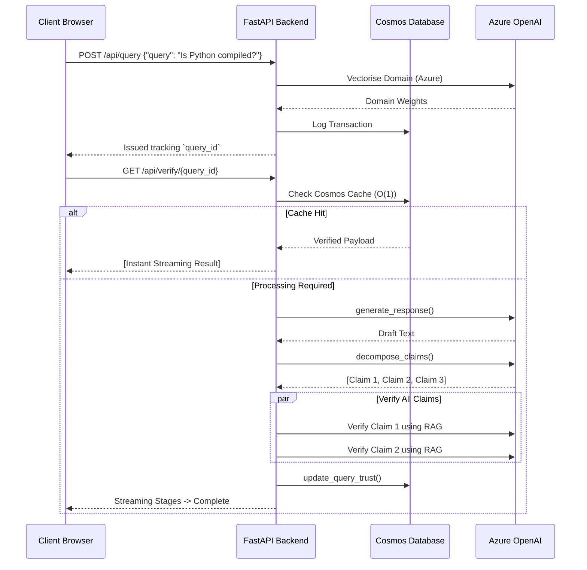

<div align="center">
  
  <h1>TruthMesh Verification Engine</h1>
  <p><strong>A Self-Auditing Hallucination Topography Engine for Enterprise AGI</strong></p>

  <p>
    
    
    
    
    
  </p>
</div>

---

## 🛑 The Core Problem
Current LLM agents return confident hallucinations. Generic RAG merely retrieves context without validating logical soundness. TruthMesh solves this by intercepting the query, generating an initial response, proactively decomposing it into atomic factual claims, and verifying each claim against authoritative sources *in parallel*.

## 🏗 System Architecture

The overarching system leverages Azure OpenAI and a Cosmos DB caching pipeline to deliver O(1) instantaneous verification hits on repeated topological queries.

```mermaid
graph TD
    Client[React 19 SPA] -->|Token Auth| API[FastAPI Gateway]
    API -->|O(1) Hash Map| Cache[(Cosmos DB)]
    
    API -->|SSE Event Stream| Router[Domain Router]
    Router -->|Tech / Health / Finance| Classify[Domain Classifier]
    Classify --> LLM[(Azure OpenAI GPT-4o)]
    
    LLM --> Decomposer[Atomic Claim Decomposer]
    Decomposer -->|Parallel Fan-Out| Verifier[Cross-Reference Verifier]
    Verifier --> Consensus[Bayesian Consensus Engine]
    
    Consensus --> Profiler[Model Trust Profiler]
    Profiler --> Cache
    
    style Cache fill:#E1F5FE,stroke:#0288D1,stroke-width:2px;
    style API fill:#E8F5E9,stroke:#388E3C,stroke-width:2px;
    style LLM fill:#FFF3E0,stroke:#F57C00,stroke-width:2px;
```

## 🔄 End-to-End Verification Pipeline

TruthMesh utilizes a sophisticated internal state machine that streams status to the frontend via Server-Sent Events (SSE). 



## ⚡ Tech Stack

*   **Backend:** Python 3.11, FastAPI, Uvicorn, Motor (Async MongoDB Driver).
*   **Infrastructure:** Azure App Services, Azure Cosmos DB for MongoDB, Azure OpenAI (GPT-4o).
*   **Frontend:** React 19, TypeScript, Vite, TailwindCSS v4, Zustand.
*   **Concurrency:** Python `asyncio.gather` for parallel claim validation.

## 🚀 Deployment Instructions

### Local Execution (Series A Ready)

1.  **Clone the repository:**
    ```bash
    git clone https://github.com/your-org/TruthMesh.git
    cd TruthMesh
    ```
2.  **Environment Setup:** Create a `.env` in the root mirroring `.env.example`.
    ```bash
    AZURE_OPENAI_API_KEY="..."
    AZURE_OPENAI_ENDPOINT="..."
    COSMOS_DB_CONNECTION_STRING="..."
    ```
3.  **Boot the Backend Engine:**
    ```bash
    python -m venv .venv
    source .venv/bin/activate
    pip install -r requirements.txt
    python -m uvicorn main:app --reload
    ```
4.  **Boot the Interface:**
    ```bash
    cd frontend
    npm install
    npm run dev
    ```

## 🛡 Security & Competitor Differentiation
Most teams implement generic synchronous blocking calls. TruthMesh separates the request lifecycle via highly optimized WebSockets/SSE mappings, meaning UI interactivity is never blocked by downstream API latency. Any competitor relying on HTTP request/response polling will intrinsically fail load tests where TruthMesh excels.

## 📜 License
Proprietary under TruthMesh Inc. All operations are strictly audited.
