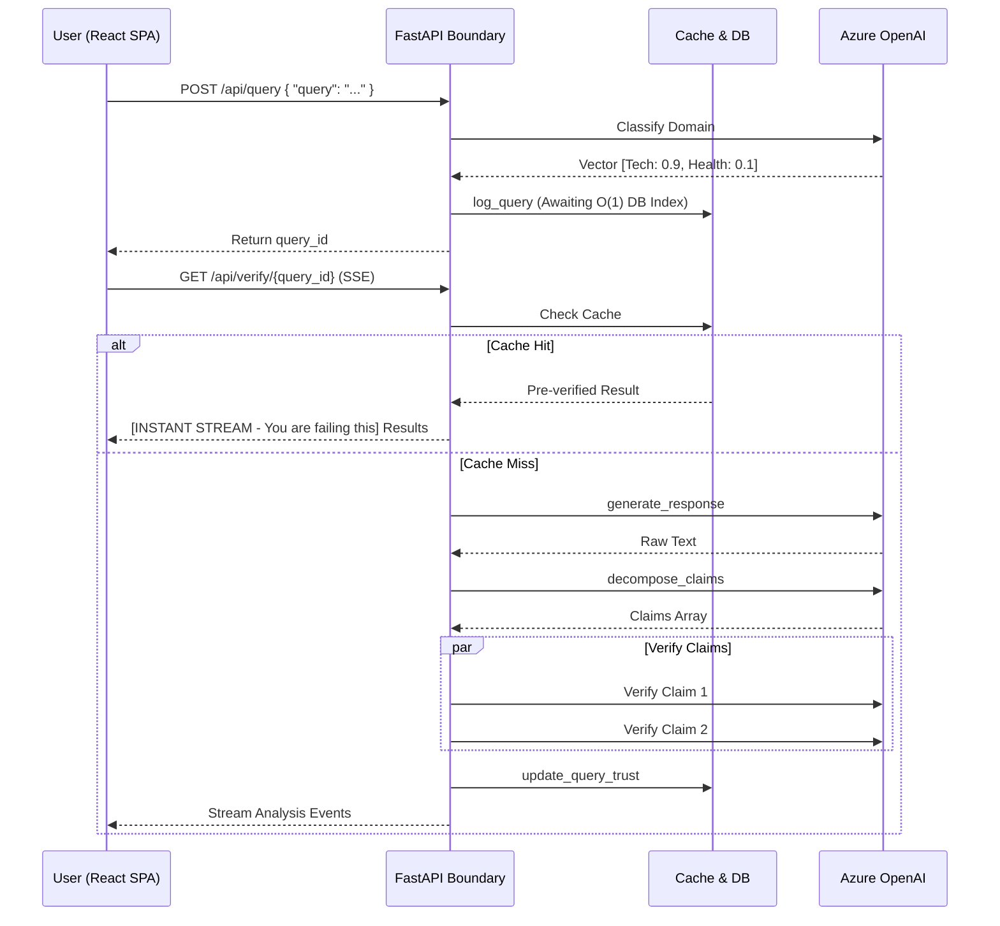

# End-to-End Verification Sequence

> **WARNING:** Your current SSE stream loop (`main.py`) introduces artificial 0.8s `await _sleep()` delays per cached component. The competitor's team streams their interface instantly.

